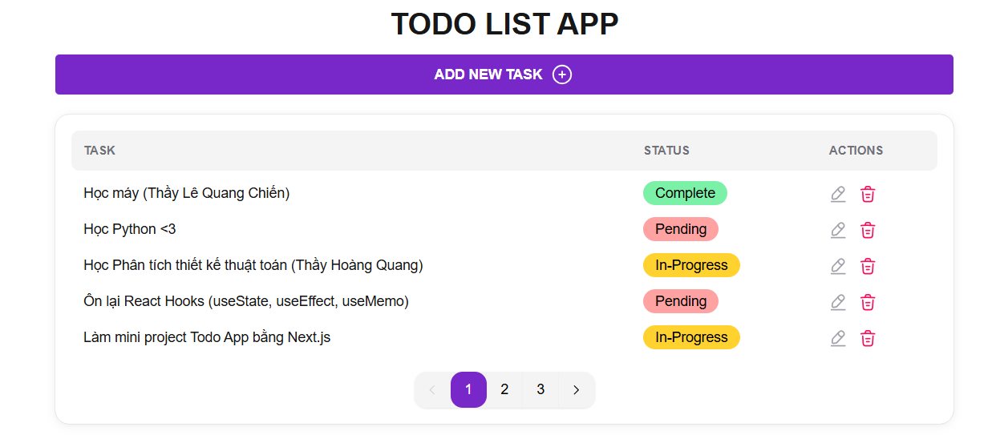

# 📝 TODO LIST APP — Next.js + TypeScript + JSON Server

Một ứng dụng **quản lý công việc (Todo List)** được xây dựng bằng **Next.js 14**, **TypeScript**, **TailwindCSS**, và **HeroUI**.  
Ứng dụng cho phép người dùng **thêm, sửa, xoá, phân trang** các task, đồng thời đang mở rộng thêm **chức năng tìm kiếm và lọc theo trạng thái (status)**.

---

## 🚀 Demo giao diện



---

## ⚙️ Công nghệ sử dụng

| Công nghệ | Mục đích |
|------------|-----------|
| **Next.js 16 (App Router)** | Framework chính, kết hợp SSR và Client Component |
| **TypeScript** | Tăng độ an toàn khi code |
| **TailwindCSS** | Thiết kế UI nhanh, gọn, responsive |
| **HeroUI** | Component UI hiện đại (Button, Modal, Pagination, Toast) |
| **JSON Server** | API giả lập backend để CRUD dữ liệu todo |
| **React Hooks** | Quản lý state và lifecycle (useState, useEffect) |

---

## 🧩 Tính năng chính

- ✅ **Hiển thị danh sách công việc (Todo List)**
- ➕ **Thêm task mới** qua form modal
- ✏️ **Sửa task**
- ❌ **Xoá task**
- 📄 **Phân trang tự động** (mỗi trang 5 task)
- 🧠 **Thông báo (Toast)** khi thêm / sửa / xoá thành công
- ⚡ **Tải lại dữ liệu trực tiếp** mà không cần reload trang

---

## 💡 Hướng phát triển tiếp theo

- 🔍 **Search**: Tìm kiếm task theo từ khoá (ví dụ: “React”, “Python”)  
- 🧭 **Filter**: Lọc task theo trạng thái (Pending, In-Progress, Complete)  
- 💾 **Kết nối database thật** (ví dụ: MongoDB hoặc PostgreSQL)  
- 📱 **Responsive UI** tốt hơn trên mobile  
- ☁️ **Triển khai bản production** trên Vercel  

---

## 📂 Cấu trúc thư mục

```bash
MY-TODO-APP/
├── app/
│   ├── favicon.ico
│   ├── globals.css
│   ├── layout.tsx
│   ├── page.tsx
│   ├── providers.tsx
│   └── profile/
│
├── components/
│   ├── AddTasks.tsx
│   ├── Modal_AddTask.tsx
│   ├── Modal_EditTask.tsx
│   ├── Modal_DeleteTask.tsx
│   ├── Pagination.tsx
│   ├── Toast.tsx
│   └── TodoList.tsx
│
├── data/
│   └── todos.json
│
├── types/
│   └── task.ts
│
├── api.ts
├── hero.ts
├── package.json
├── next.config.ts
├── postcss.config.js
├── tailwind.config.ts
└── README.md
```

---

## 🧠 Cách cài đặt & chạy dự án

### 1️⃣ Cài dependencies

```bash
npm install
```

### 2️⃣ Chạy JSON Server (API)

```bash
npx json-server --watch data/todos.json --port 3001
```

> Server API sẽ chạy ở: **http://localhost:3001/task**

### 3️⃣ Chạy Next.js App

```bash
npm run dev
```

> App frontend chạy ở: **http://localhost:3000**

---

## 📸 API mẫu (JSON Server)

Ví dụ file `todos.json`:

```json
{
  "task": [
    {
      "id": 1,
      "title": "Học máy (Thầy Lê Quang Chiến)",
      "status": "Complete"
    },
    {
      "id": 2,
      "title": "Ôn lại React Hooks (useState, useEffect, useMemo)",
      "status": "In-Progress"
    }
  ]
}
```

---

## 👨‍💻 Tác giả

**Hoàng Bảo Khánh**  
📧 Email: [Hbkhanh0706@gmail.com](mailto:Hbkhanh0706@gmail.com)  
💻 GitHub: [github.com/hoangbaokhanh1511](https://github.com/hoangbaokhanh1511)


✨ *Made with passion by Hoàng Bảo Khánh*
